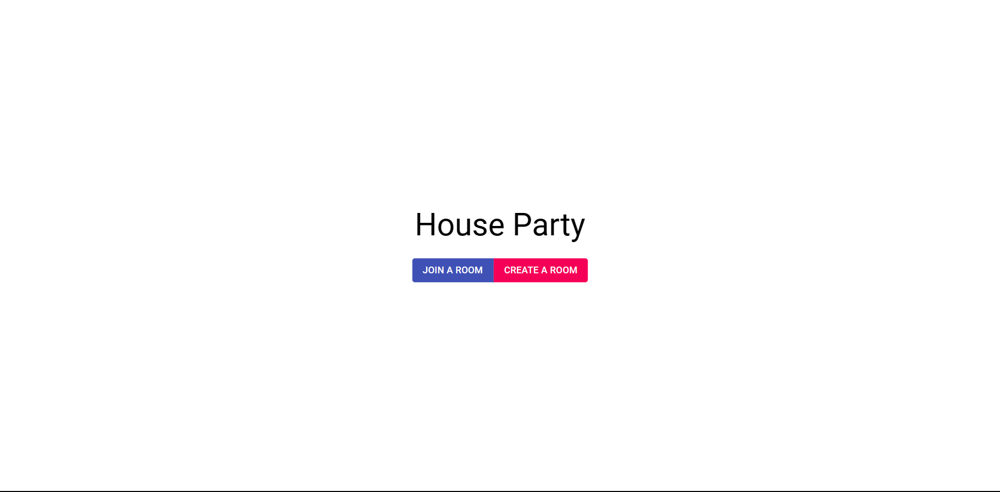

# Music Controller App

What is a Music Controller?

1. It’s a spotify premium feature of group party
2. Here we have Integrated spotify API’s so we take user credentials & have their data
3. After that we connect them via a concept of Room
4. It’s concept where device will be connected to each other & play the same song

## How to run the app?

1. Install the requirements

    pip install -r requirements.txt

2. Install the lost package

    pip install requests

3. Run the server

    python manage.py runserver

## Technology used

    DJANGO

    HTML 

    CSS

    JAVASCRIPT

    REACTJS

    SQL
